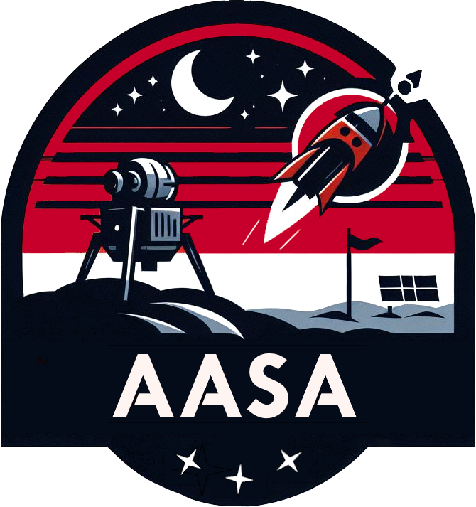

# 🌌 AAADLander – Vloeistofonderzoeksmodule

Welkom bij de officiële repository van de **Vloeistofonderzoeksmodule** van de AAAdlander!  
Deze module is onderdeel van het Interdisciplinair Project Informatica & Engineering van Avans 2025 en is ontworpen om vloeistofmonsters te nemen en te analyseren op locatie.

 

## Over deze module

De vloeistofonderzoeksmodule maakt deel uit van een modulaire maanlander-opstelling. Onze specifieke module heeft als taak om een vloeistofmonster te nemen en daarvan de temperatuur nauwkeurig te meten.

 

## Functionaliteiten

- Nemen van een vloeistofmonster (automatisch op commando)  
- 5-voudige temperatuurmeting van het vloeistofmonster  
- Draadloze communicatie via NRF24 met een satelliet  
- Data-overdracht naar een webapplicatie via NodeRed server en WebSockets  
- Dashboard toont temperatuurresultaten  
- LED-indicatie bij communicatieproblemen  
- Zelfstandige energievoorziening  
- Lokale backup testmogelijkheden via USB  

